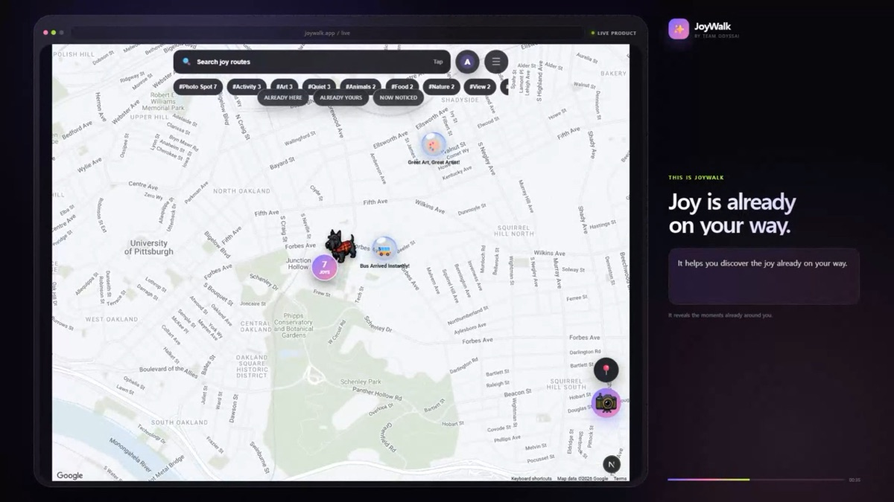
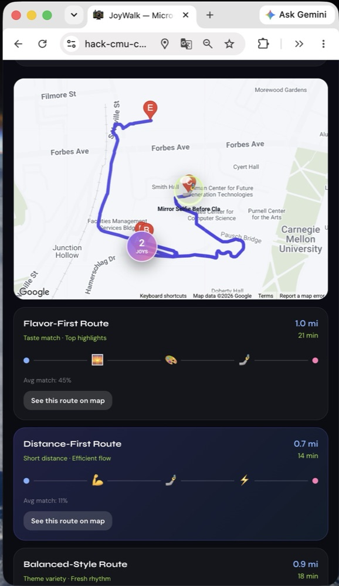
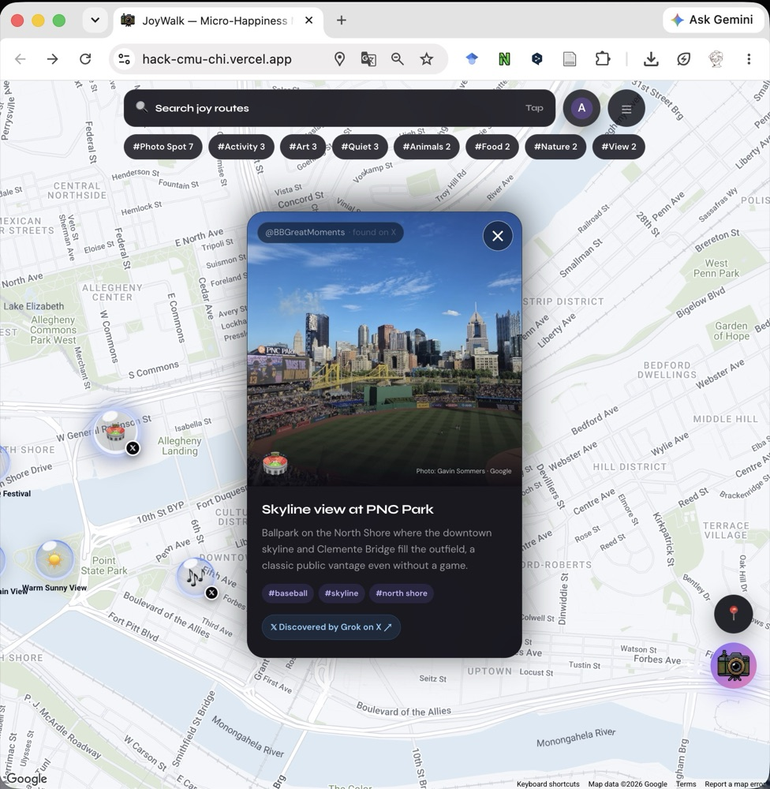
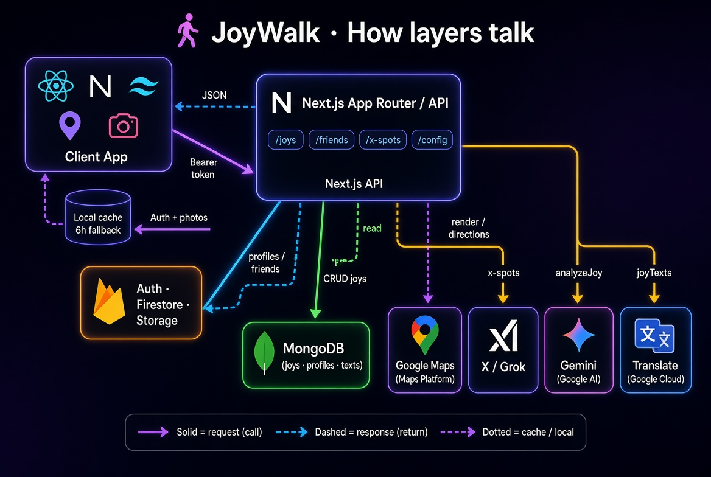
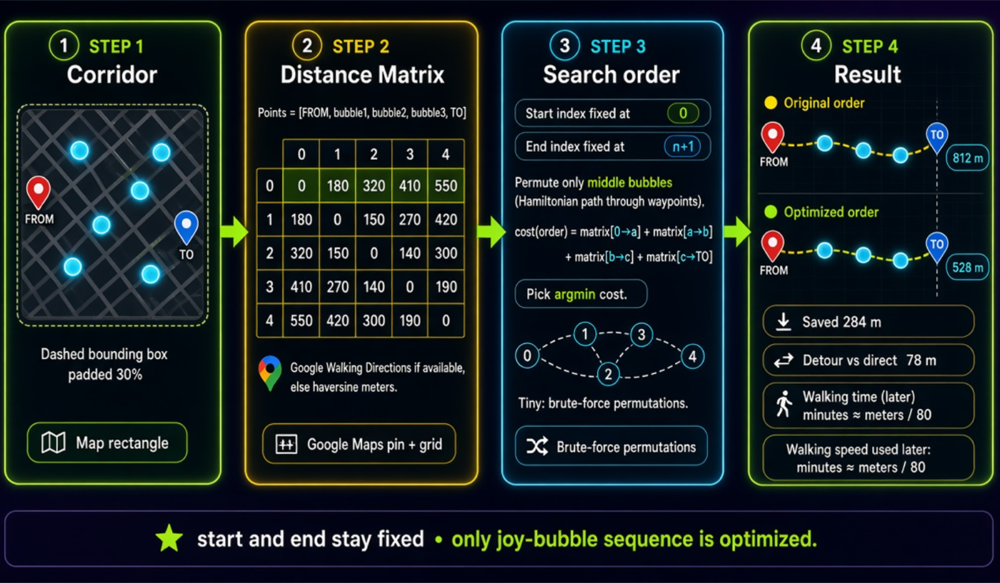

# ✨ JoyWalk (Micro-Happiness Map)

🏆 **Winner — Best Use of API (Vultr) @ HackCMU 2026**

[▶️ Demo Video](https://youtu.be/2Iy9umJSEdc) · [🌐 Live Demo](https://joywalk-small-happiness.dyheo619.chatgpt.site/) · [📑 Slides](docs/HackCMU-Slides.pdf)

JoyWalk is a walking-route app built around *so-hwak-haeng* — the Korean idea of "small but certain happiness."
Instead of just guiding you along the fastest path, JoyWalk routes you past nearby **Joy Spots**: a friendly dog someone photographed, cherry blossoms in bloom, a cozy café — small, delightful moments other people have left behind along the way.

---

## 👥 Team — OdyssAI

Built at HackCMU 2026. This repository is a fork of the team's original repo, maintained here by Seungyeon Baek.

- Doyoung Heo — [@Doyoung619](https://github.com/Doyoung619)
- Yucheon Park — [@yucheon6000](https://github.com/yucheon6000)
- Minki Kim
- Seungyeon Baek — [@seungyeon59](https://github.com/seungyeon59)

Original repository: [Doyoung619/Small-Happiness](https://github.com/Doyoung619/Small-Happiness)

---

## 📸 Screenshots

### Joy Map

*Small joys shared by other people appear as glowing bubbles on the map, filterable by category.*

### Joy Route Recommendations

*JoyWalk proposes several route styles — flavor-first, distance-first, or balanced — each trading off directness for how many joy spots it passes.*

### Joy Spot Detail

*Tapping a spot reveals its story, photo, and tags — including spots that were discovered automatically from public X posts.*

---

## 🎯 Core Features

### 1. ✨ Joy Route Recommendation (Detour Routing)
* Enter a starting point (FROM) and destination (TO), and JoyWalk personalizes nearby Joy Spots with hybrid collaborative filtering, then optimizes the visiting order as a shortest Hamiltonian path.
* Rather than the fastest route, it intentionally proposes a detour that lets you encounter small joys along the way.
* Walking directions, distance, and duration are powered by the Google Maps Directions API.

### 2. 📍 Share a Joy From Where You Stand
* Leave a happy moment right where you're standing, the instant it happens.
* **📸 Take a Photo or Pick from Your Album**: launch your laptop or phone camera directly, or upload from your gallery (front/back camera switching supported).
* **🤖 Automatic Emoji Suggestions**: analyzes keywords in what you write (e.g. "the coffee smell here is amazing") and suggests a matching emoji (☕, 🌸, 🐕, etc.).
* Shared pins appear on the map instantly and can be recommended into other people's walking routes.

### 3. 🗺️ Gen-Z Map UI
* Smooth animations and responsive interactions (spring effects, glassmorphism) inspired by Apple's Fluid Interface design language.
* A trendy "dopamine palette" combining a dark background with neon colors (purple, pink, lime).

### 4. 𝕏 Real-Time Spot Discovery with Grok
* On the server, the xAI Responses API's `grok-4.6` model with the `x_search` tool scans recent public X posts from Pittsburgh.
* Only results with a publicly visitable location and a verifiable X post link are converted into map bubbles.
* Results are cached for 6 hours, and existing community spots are always shown first, so API latency or rate limits never break the demo.
* The API key never ships in the client bundle — it's only used server-side via the deployment's `XAI_API_KEY` secret.

---

## 🧩 How It Works

### System Architecture

*The Next.js API layer sits between the client app and every external service — Firebase for auth and photos, MongoDB for joy data, Google Maps for routing, and Grok / Gemini / Translate for spot discovery and enrichment.*

### Route Optimization (Hamiltonian Path)

*Joy spots near the direct route are collected into a corridor, converted into a distance matrix, and the visiting order is optimized as a small Hamiltonian-path problem — the start and end points stay fixed, and only the joy-spot sequence is optimized.*

---

## 🛠️ Tech Stack

* **Framework**: [Next.js (App Router)](https://nextjs.org/) + [React](https://react.dev/)
* **Styling**: [TailwindCSS](https://tailwindcss.com/) (mixed with inline styles for precise layout control)
* **Maps & Routing**: [Google Maps Platform](https://developers.google.com/maps)
  * Maps JavaScript API (map rendering and custom markers)
  * Places API (place autocomplete search)
  * Directions API (walking routes with waypoints)
  * Geocoding API (coordinate ↔ address conversion)
* **Camera Access**: `navigator.mediaDevices.getUserMedia` (pure web standard API)
* **AI Spot Discovery**: xAI Responses API + Grok 4.6 + X Search + JSON Schema structured outputs

---

## 📂 Project Structure

```text
joywalk/
├── app/
│   ├── page.tsx               # Main page — map view, modals, state management, rendering
│   ├── globals.css            # Global styles and custom design system (Gen-Z style)
│   └── layout.tsx
├── components/
│   ├── MapView.tsx            # Google Maps rendering, pins, "find my location", route drawing
│   ├── RoutePanel.tsx         # FROM/TO input and Joy Route search UI
│   ├── JoyCard.tsx            # Detail view for a single joy pin and route summary
│   ├── ShareAtLocationModal.tsx # Modal for sharing a new joy at your current location (includes camera)
│   └── ShareModal.tsx         # Modal for adding your own experience to an existing pin
└── lib/
    ├── routing.ts             # Bounding-box calculation and waypoint-sampling logic
    ├── autoEmoji.ts           # Keyword-based emoji suggestion logic
    └── mockPins.ts            # Initial dummy data (joy pins around Pittsburgh)
```

---

## 🚀 Future Scope

Right now, recommendation differences are demonstrated using 15 local mock users and 3 demo personas. The next step is to replace those mock signals with real like/visit events streamed into Firestore.
